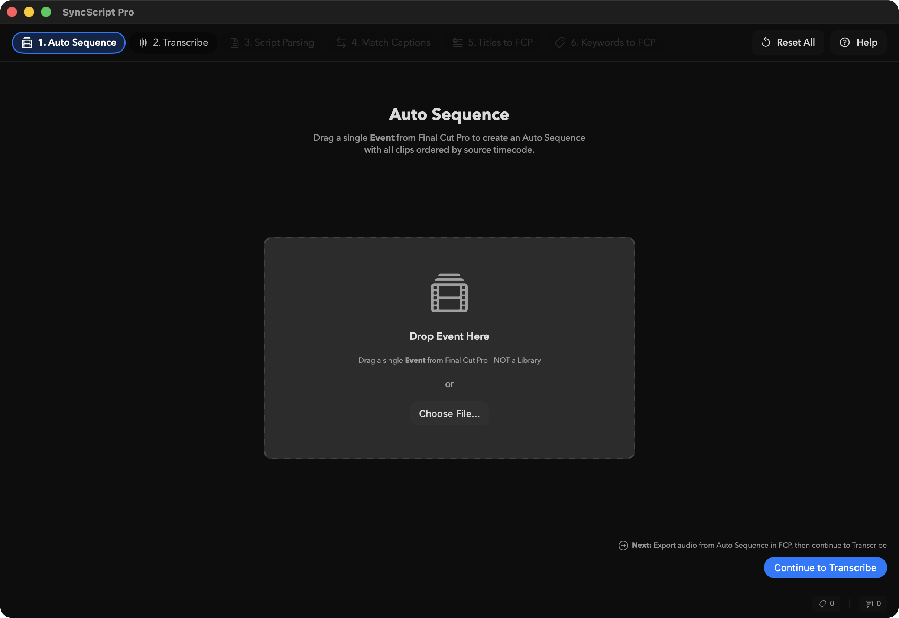
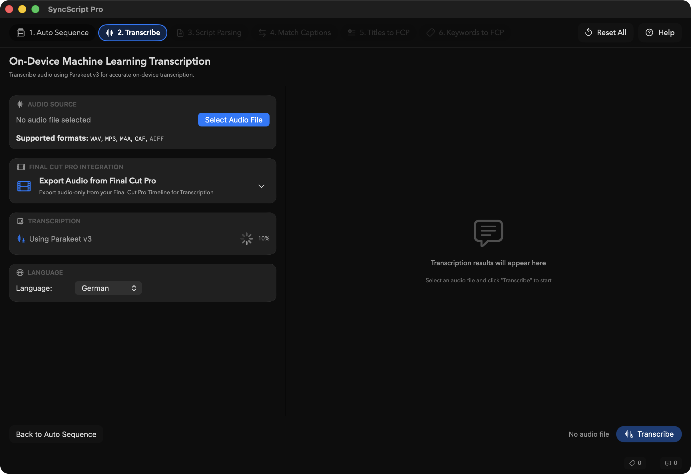

# SyncScript Pro

!!!tip Now in public beta! 🥳
SyncScript Pro is currently in public beta.\
You can download it on Apple's [TestFlight](https://testflight.apple.com/join/T1r9q74W).
!!!

**SyncScript Pro** allows you to synchronise script lines with transcribed Captions and generate Keywords on Browser clips for script lines.

---

## Features

### Page 1: Script Parsing
- Parse screenplay/script files (`PDF` and `TXT`)
- Extract dialogue Keywords with character names
- Support for scene numbers and take information

### Page 2: Autosequence Generation
- Import `FCPXML` from Final Cut Pro Browser
- Generate **Auto Sequence** Timeline from Clips
- Audio export for Transcription

### Page 3: Transcription
- Transcribe audio using **Parakeet** (`v2`/`v3`) or **Apple Speech Pro** (macOS 26 Tahoe)
- Speaker diarization support
- Generate Captions with precise timing

### Page 4: Caption Matching
- Match script keywords to transcribed Captions
- Semantic matching using embeddings
- Import `FCPXML` timeline with Captions

### Page 5: Titles to FCP
- Generate Titles for matched Keywords
- Speaker-specific roles for color coding
- Trigger phrase support (start/end triggers)
- Make **Action Cut** ranges
- Export to Final Cut Pro

### Page 6: Keywords to FCP
- **Titles to Keywords** - Convert timeline titles to keywords on browser clips (based on CommandPost's approach)
- Convert matched Titles back to Keywords on the original source clips

---

## Titles to Keywords

Based on CommandPost's **Titles to Keywords** toolbox, this feature:

- Finds all titles on the Timeline with their absolute positions
- Finds clips in the Spine with their timing information
- Checks which Titles intersect with which clips
- Converts timeline positions to source clip internal timecodes
- Adds `<keyword>` elements to clips in the Event Browser, not the Timeline

---

## Event Naming

SyncScript Pro creates consistently named Events when exporting to Final Cut Pro:

- **02 Auto Sequence** - Generated Auto Sequence timeline
- **03 Transcribe Captions** - Transcribed Captions
- **05 Titles** - Generated Titles for matched keywords
- **06 Keywords** - Keywords applied to Browser Clips

---

## FCPXML Support

- Supports FCPXML versions up to **FCPXML v1.14**.